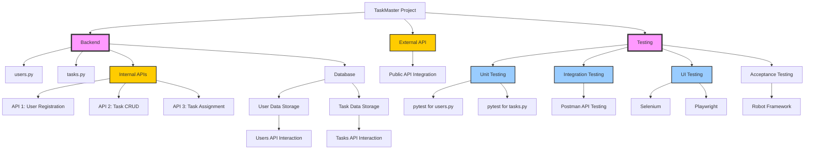

# Wiggins Project Ideas

## Prompt 1

**Prompt Used:**
What are good small projects that would allow me to demonstrate pytest for unit and integration testing, postman, selenium, playwright, and robot framework testing? It needs to be modularized so that 3 - 6 people can work on it and minimize version control conflict using GitHub. The project needs to have at least 3 internal APIs and use a free public one. The selenium needs to be able to test at least 6 of the following UI elements: Form Submissions, Link and Button Clicks, Dropdown Menus, Mouse Actions, Keyboard Inputs, Layout Testing, Page Navigation, Data Entry and Retrieval, Data Validation, Error Messages, and Handling Exceptions.

**Response:**
A great project idea that meets all your requirements is a modular task management web application with APIs and a UI that allows users to create, edit, delete, and manage tasks. A web-based task management system where users can:

- Create and manage tasks with deadlines and priorities.
- Assign tasks to different users.
- Track task progress (To Do, In Progress, Done).
- Integrate with a public API (e.g., OpenWeather API to attach weather conditions to tasks).

---

## Prompt 2

**Prompt Used:**
Create a project plan and structure for this.

**Response:**
📌 Project Plan: TaskMaster
A modular task management system designed for testing with Pytest, Postman, Selenium, Playwright, and Robot Framework.

📅 Project Timeline (6 Weeks)
| Week      |                           Tasks                                     |
|-----------|---------------------------------------------------------------------|
| 1         | Define project scope, set up GitHub repo, and assign roles.         |
| 2         | Backend: Set up FastAPI and database. Frontend: Basic UI structure. |
| 3         | Develop and integrate APIs. UI connects to APIs.                    |
| 4         | Implement authentication, task features, and public API.            |
| 5         | Write unit, integration, and UI tests.                              |
| 6         | Final testing, bug fixes, and documentation.                        |

🛠 Project Structure (GitHub Repo)
```
TaskMaster/
│── backend/                 # FastAPI Backend
│   ├── app/
│   │   ├── main.py          # Entry point
│   │   ├── models.py        # Database models
│   │   ├── routes/
│   │   │   ├── users.py     # User APIs (Register/Login)
│   │   │   ├── tasks.py     # Task APIs (CRUD)
│   │   │   ├── analytics.py # Task analytics API
│   │   ├── services/        # Business logic
│   │   ├── tests/           # Pytest unit/integration tests
│   ├── requirements.txt     # Backend dependencies
│   ├── Dockerfile           # Containerization
│
│── frontend/                # React or HTML/CSS/JS UI
│   ├── src/
│   │   ├── components/      # UI components
│   │   ├── pages/           # Main pages (Home, Dashboard, Login)
│   │   ├── App.js           # Main React App
│   ├── public/              # Static assets
│   ├── package.json         # Frontend dependencies
│
│── tests/                   # Automated UI tests
│   ├── selenium/            # Selenium test scripts
│   ├── playwright/          # Playwright test scripts
│   ├── robot/               # Robot Framework tests
│
│── docs/                    # Documentation
│   ├── API_docs.md          # API documentation
│   ├── Setup.md             # Installation guide
│   ├── Testing_Guide.md     # How to run tests
│
│── .github/                  # GitHub Actions (CI/CD)
│   ├── workflows/
│   │   ├── ci-cd.yml        # Continuous Integration workflow
│
│── README.md                 # Project Overview
│── .gitignore                # Ignore unnecessary files


```
---

## Prompt 3

**Prompt Used:**
Break out the backend more so they can work and use Flask to develop with Python.

**Response:**
Here's an updated project plan with a more detailed Flask backend structure to support modular development and team collaboration.

📌 Project Plan: TaskMaster
A Flask-based task management system with modular APIs, UI, and automated testing.

🛠 Backend Structure (Flask)
```
backend/
│── app/                     # Main application folder
│   ├── __init__.py          # Initialize Flask app
│   ├── config.py            # Configuration settings (database, API keys)
│   ├── models/              # Database models
│   │   ├── __init__.py      # Import models
│   │   ├── user.py          # User model
│   │   ├── task.py          # Task model
│   ├── routes/              # API endpoints
│   │   ├── __init__.py      # Import all routes
│   │   ├── user_routes.py   # User-related API endpoints
│   │   ├── task_routes.py   # Task management endpoints
│   │   ├── analytics_routes.py # Task statistics endpoints
│   ├── services/            # Business logic layer
│   │   ├── user_service.py  # Handles user authentication, validation
│   │   ├── task_service.py  # Manages task logic (CRUD, priority, status)
│   │   ├── analytics_service.py # Aggregates task completion stats
│   ├── utils/               # Helper utilities
│   │   ├── validators.py    # Input validation functions
│   │   ├── auth.py          # Authentication helpers (JWT)
│   ├── tests/               # Pytest unit and integration tests
│   │   ├── test_users.py    # User API tests
│   │   ├── test_tasks.py    # Task API tests
│   │   ├── test_analytics.py # Analytics API tests
│   ├── database.py          # Database connection
│   ├── run.py               # Flask application entry point
│
│── requirements.txt         # Dependencies
│── Dockerfile               # Containerization setup
│── .env                     # Environment variables (secret keys, DB URL)
```

---

## Prompt 4

**Prompt Used:**
Revise to complete in 4 sprints with each sprint being two weeks.

**Response:**
🗓 Sprint Breakdown (2 Weeks Each)
|Sprint     |	Goals           |	Deliverables            |
|-----------|-------------------|---------------------------|
|Sprint 1: Project Setup & User Module|Set up repo, Flask structure, database, authentication |✅ GitHub repo, Flask app scaffold, User API (register/login/profile), database setup, initial Postman tests|
|Sprint 2: Task Management Module     |Implement CRUD operations for tasks, integrate frontend UI |✅ Task API (create/update/delete), basic UI forms for tasks, database migrations, API unit tests        |
|Sprint 3: Analytics & Public API Integration|Task analytics, external API integration, UI enhancements |✅ Analytics API, OpenWeather API integration, task filtering UI, Pytest integration tests |
|Sprint 4: Testing & Deployment         |Automated UI testing, final bug fixes, deployment setup |✅ Selenium & Playwright tests, Robot Framework E2E tests, Docker deployment, CI/CD pipeline  |

✅ Sprint-by-Sprint Deliverables
Sprint 1: Project Setup & User Module
- Set up Flask structure
- Configure PostgreSQL/MySQL database
- Implement User API (register, login, profile)
- Set up JWT authentication
- Initial Postman API tests
- CI/CD pipeline setup (GitHub Actions)
👉 End of Sprint Deliverable: Backend running with authentication, database, and user management.

Sprint 2: Task Management Module
- Implement Task API (CRUD operations)
- Create Task UI (React or HTML/CSS/JS)
- Add task filtering & priority selection
- Database migrations for tasks
- API unit tests using Pytest
👉 End of Sprint Deliverable: Users can create, update, and manage tasks via API and UI.

Sprint 3: Analytics & Public API Integration
- Implement Analytics API (completion rates, task statistics)
- Integrate OpenWeather API (attach weather data to tasks)
- UI updates for task progress tracking
- Integration tests for Task + Analytics APIs
- Data validation for API responses
👉 End of Sprint Deliverable: Task analytics and external API integration functional.

Sprint 4: Testing & Deployment
- Automate UI testing with Selenium & Playwright
- Implement Robot Framework for E2E workflows
- Final bug fixes and UI refinements
- Dockerize Flask app and deploy
- Final testing of CI/CD pipeline
👉 End of Sprint Deliverable: Fully tested and deployed TaskMaster application.
---

## Prompt 5

**Prompt Used:**
Create a detailed test plan with test cases. Make sure that each of the selenium test requirments are met: Form Submissions: Test form filling, submissions, and validation messages. - Link and Button Clicks: Automate clicking on various links and buttons to ensure they lead to the correct actions or pages. - Dropdown Menus: Test interactions with dropdown menus, including selecting various options. - Mouse Actions: Simulate mouse actions like clicks, double-clicks, hover, and drag-and-drop. - Keyboard Inputs: Test keyboard interactions, including text input and keyboard shortcuts. - Layout Testing: Check the layout and positioning of UI components. - Page Navigation: Test navigation between different pages or sections of the application. - Data Entry and Retrieval: Test CRUD (Create, Read, Update, Delete) operations on data. - Data Validation: Ensure the correctness of data processing and output. - Error Messages: Test for correct error messages under various error conditions. - Handling Exceptions: Ensure the application handles unexpected exceptions gracefully.

**Response:**
### **📌 TaskMaster Test Plan**  

#### **🛠 Test Strategy**
- **Unit Testing**: Validate individual functions and API endpoints using **Pytest**.
- **Integration Testing**: Ensure correct interaction between APIs and database.
- **API Testing**: Use **Postman** and **Pytest** for REST API validation.
- **UI Testing**: Automate interactions using **Selenium** and **Playwright**.
- **End-to-End (E2E) Testing**: Automate user flows with **Robot Framework**.

---

#### **✅ Test Cases Breakdown**

##### **1️⃣ Unit Tests (Pytest)**
| **Test Case** | **Description** | **Expected Result** |
|--------------|---------------|---------------------|
| `test_register_user` | Register a user with valid data | Returns 201, user created |
| `test_login_user` | Login with valid credentials | Returns 200, JWT token issued |
| `test_create_task` | Create a new task with valid input | Returns 201, task created |
| `test_update_task` | Update task status | Returns 200, task updated |
| `test_delete_task` | Delete a task | Returns 200, task deleted |
| `test_invalid_login` | Login with incorrect password | Returns 401, error message |

---

##### **2️⃣ API Tests (Postman & Pytest)**
| **Test Case** | **API Endpoint** | **Method** | **Expected Result** |
|--------------|-----------------|------------|---------------------|
| `test_register_api` | `/register` | `POST` | Returns 201, success |
| `test_login_api` | `/login` | `POST` | Returns 200, JWT token |
| `test_create_task_api` | `/tasks` | `POST` | Returns 201, task created |
| `test_get_tasks_api` | `/tasks` | `GET` | Returns 200, list of tasks |
| `test_update_task_api` | `/tasks/<id>` | `PUT` | Returns 200, task updated |
| `test_delete_task_api` | `/tasks/<id>` | `DELETE` | Returns 200, task deleted |

---

##### **3️⃣ UI Tests (Selenium & Playwright)**  
| **Test Case** | **Scenario** | **Expected Outcome** |
|--------------|-------------|---------------------|
| **Form Submissions** | Fill and submit the user registration form | Success message appears |
| **Form Validations** | Submit form with missing fields | Error messages appear |
| **Login Test** | Enter valid credentials and submit | User is redirected to dashboard |
| **Incorrect Login** | Enter incorrect credentials | Error message appears |
| **Task Creation** | Fill and submit task form | Task appears in task list |
| **Task Deletion** | Click delete on a task | Task disappears from list |

---

##### **4️⃣ UI Navigation & Interaction Tests (Selenium & Playwright)**
| **Test Case** | **Scenario** | **Expected Outcome** |
|--------------|-------------|---------------------|
| **Link and Button Clicks** | Click "Add Task" button | Task form appears |
| **Dropdown Menus** | Select task priority from dropdown | Selected value is saved |
| **Mouse Actions** | Drag a task to "Completed" section | Task status updates |
| **Keyboard Inputs** | Enter text in task description | Text appears correctly |
| **Layout Testing** | Check if UI elements are positioned correctly | Elements align properly |
| **Page Navigation** | Click "Dashboard" link | User is taken to Dashboard |
| **CRUD Operations** | Create, edit, delete a task | Task updates accordingly |

---

##### **5️⃣ Data Validation Tests**
| **Test Case** | **Scenario** | **Expected Outcome** |
|--------------|-------------|---------------------|
| **Invalid Task Data** | Submit a task without title | Error message appears |
| **Fetch Task Data** | Get tasks from API | Data matches database |
| **Task Updates** | Update a task and fetch it | Updated data is returned |

---

##### **6️⃣ Error Handling & Exception Tests**
| **Test Case** | **Scenario** | **Expected Outcome** |
|--------------|-------------|---------------------|
| **Invalid API Request** | Send incorrect API format | Returns 400 Bad Request |
| **Unhandled Exception** | Trigger a server crash | Server logs error gracefully |
| **Authentication Required** | Access API without login | Returns 401 Unauthorized |

---

##### **7️⃣ End-to-End (E2E) Tests (Robot Framework)**
| **Test Case** | **Scenario** | **Expected Outcome** |
|--------------|-------------|---------------------|
| **User Registration** | Complete user signup, login, create task | User registered, logged in, task created |
| **Full Task Flow** | Create, update, delete a task | Task lifecycle functions correctly |
| **Dashboard View** | Load dashboard with multiple tasks | Tasks are displayed properly |

---

##### **🔄 CI/CD Integration**
- **Run Pytest on every commit**
- **Trigger Selenium tests on UI updates**
- **Deploy only if tests pass**

---

## Prompt 6

**Prompt Used:**
I am responsible for `users.py`. What would be a recommended start and strategy for this using Python and Flask?

**Response:**
Since you're handling users.py, your focus will be on user authentication and management using Flask.

📌 Step 1: Define the Scope of users.py
Your module should include:

- User Registration (storing user details securely)
- User Authentication (JWT-based login/logout)
- User Authorization (role-based access if needed)
- User Profile Management (view/update profile)
- Password Hashing & Security (using werkzeug.security)
- Error Handling (handling invalid credentials, expired tokens, etc.)

🛠 Step 2: Set Up the Flask User Blueprint

🔑 Step 3: Implement User Authentication APIs

📌 Step 4: Integrate and Test

📌 Step 5: Unit & API Testing Strategy

📌 Summary of Strategy
✅ Use Flask Blueprint for modularity
✅ Implement JWT authentication for secure user management
✅ Hash passwords using werkzeug.security
✅ Add decorators for protected routes
✅ Write unit and integration tests with pytest
✅ Use Postman for API testing
---

## Prompt 7

**Prompt Used:**
I am responsible for `tasks.py`. What would be a recommended strategy to develop this and ensure it works with `users.py`?

**Response:**
📌 Recommended Strategy for Developing tasks.py
Since tasks.py handles task management, it needs to integrate seamlessly with users.py for authentication and user ownership. The approach involves:

1. Creating task models & relationships (each task belongs to a user).
2. Implementing CRUD operations (Create, Read, Update, Delete).
3. Ensuring authentication (only logged-in users can manage tasks).
4. Adding validation & error handling (ensuring data integrity).
5. Writing unit and API tests using pytest and Postman for validation.

📌 Summary of Strategy
✅ Integrate with users.py → Ensure only logged-in users manage tasks
✅ Use Flask Blueprint → Keep modular and maintainable code
✅ Secure with JWT Authentication → Only authorized users can access tasks
✅ CRUD Operations Implemented → Users can create, view, update, and delete tasks
✅ Database Relationship Established → Each task is tied to a user
✅ Unit & Integration Testing → Ensures API works as expected
---

## Prompt 8

**Prompt Used:**
What do I need from the programmer developing `users.py`, and if they are not complete, what can I do for my responsibility of `tasks.py`?

**Response:**
Since tasks.py depends on user authentication and authorization, you need the following from the users.py developer:

1. User Authentication API (JWT Token Handling)
- You need a way to validate users via login (/api/users/login) and retrieve a JWT token.
- The token_required decorator must be implemented and available for use in tasks.py.

2. User Registration API (/api/users/register)
- Users need to be created before assigning tasks.

3. Token Validation (token_required)
- You need to ensure the token_required decorator properly extracts user data from the JWT.
- It should provide the current_user object when decorating tasks.py routes.

4. User ID Access
- The User model should provide an accessible user ID to associate with tasks in the database.
- tasks.py must be able to retrieve current_user.id inside its API routes.

📌 If users.py is Not Complete, What Can You Do?
1️⃣ Develop tasks.py with Mocked User Authentication
If users.py is not ready yet, you can mock the authentication layer to proceed with development.
2️⃣ Work on CRUD Operations First
You can implement and test task creation, retrieval, updating, and deletion without authentication initially.
- Use dummy user IDs in the database.
3️⃣ Write Unit Tests Without Authentication First
You can test task operations while ignoring authentication initially. Later, add token-based tests.

📌 Summary
✅ You Need from users.py Developer:
- User authentication (/api/users/login, JWT token)
- User registration (/api/users/register)
- Token validation (token_required)
- User ID access (current_user.id)

✅ If users.py is Not Ready:
- Mock authentication to continue working
- Develop CRUD operations with dummy user IDs
- Write unit tests without authentication first

---

## Prompt 9

**Prompt Used:**
Assuming coding has not yet started, create a mermaid diagram that would help resolve issues as above.

**Response:**


---

## Prompt 10

**Prompt Used:**
I am responsible for the UI being used in the application. Give me a recommended strategy and plan.

**Response:**
### UI Strategy
1. **Tech Stack**: Use React/Vue.js, Bootstrap/Tailwind CSS, and state management (e.g., Redux).
2. **Modular Design**: Break UI into reusable components (buttons, forms, task lists).
3. **UX Focus**: Ensure responsiveness, accessibility, and smooth interactivity.
4. **Backend Collaboration**: Integrate API data, user authentication, and session management.

### UI Plan

#### **Sprint 1**: (2 Weeks)
- Set up project with UI framework, build basic components.
- Create user login/signup pages, ensure responsiveness.

#### **Sprint 2**: (2 Weeks)
- Develop task dashboard with CRUD functionality.
- Integrate APIs, handle form validation, and manage state.

#### **Sprint 3**: (2 Weeks)
- Add modals, error notifications, sorting/filtering for tasks.
- Perform UI interaction testing (Selenium/Playwright).

#### **Sprint 4**: (2 Weeks)
- Finalize cross-browser and accessibility testing.
- Polish UI, gather feedback from stakeholders, prepare for deployment.

### Additional Tips:
- Use Git for version control.
- Automate UI testing.
- Document components for consistency.

---

## Prompt 11

**Prompt Used:**
We are using Flask for the code above ... revise the structure as needed.

**Response:**
### UI Strategy
1. **Tech Stack**: Use React/Vue.js with Flask as the backend. Flask serves the frontend through templates or via API for a decoupled frontend (using Flask-RESTful).
2. **Modular Design**: Flask’s structure allows for blueprint-based modularization. Break UI components into reusable elements (e.g., forms, modals, task lists).
3. **UX Focus**: Ensure responsiveness and smooth interactivity. Handle Flask’s session management for user authentication.
4. **Backend Collaboration**: Flask routes will serve data (via API or templates). Work with backend for API integration and user authentication.

### UI Plan

#### **Sprint 1**: (2 Weeks)
- **Set up Flask project** with routes for UI and API endpoints.
- **Create base templates** and layout (using Jinja2 for dynamic data).
- **Build core components** (buttons, forms).
- Develop user authentication UI (login/signup).

#### **Sprint 2**: (2 Weeks)
- **Task Dashboard**: Implement CRUD for tasks (flask routes for tasks).
- **API Integration**: Fetch data from Flask APIs and render in the UI.
- **Form Validation**: Implement frontend validation and integrate with Flask backend validation.

#### **Sprint 3**: (2 Weeks)
- **Modals & Notifications**: Add interactive modals for task management.
- **Sorting/Filtering**: Use Flask for API endpoints to filter tasks.
- **UI Testing**: Write tests for UI interactions (Selenium/Playwright) and Flask routes.

#### **Sprint 4**: (2 Weeks)
- **Cross-browser Testing**: Test Flask-rendered pages across browsers.
- **Polish UI**: Finalize UI elements, animations, and transitions.
- **Prepare for Deployment**: Final testing and feedback from stakeholders.

---

## Prompt 12

**Prompt:**
Revise the structure above to provide details under `app/`.

**Response:**
Revised Flask Project Structure
```plaintext
app/
│
├── __init__.py                  # Initializes the Flask app
├── routes/                      # Flask route definitions
│   ├── auth_routes.py           # Authentication (login, signup)
│   ├── task_routes.py           # Task CRUD operations
│   ├── api_routes.py            # API routes (AJAX calls)
│
├── templates/                   # HTML templates (Jinja2)
│   ├── base.html                # Base layout template
│   ├── login.html               # Login page
│   ├── signup.html              # Signup page
│   ├── dashboard.html           # Task dashboard page
│   ├── task_form.html           # Form for tasks
│
├── static/                      # Static assets (CSS, JS, images)
├── models/                      # Database models (SQLAlchemy)
│   ├── user.py                  # User model
│   ├── task.py                  # Task model
│
├── forms/                       # Form classes for user input
└── config.py                    # App configuration
```

---

## Prompt 13

**Prompt Used:**
Provide test cases, including edge cases, for the above.

**Response:**

**Authentication Tests**
1. Valid Login: Log in with correct credentials, expect redirect to dashboard.
2. Invalid Login: Log in with wrong credentials, expect error message.
3. Valid Signup: Register with valid data, expect login page or auto-login.
4. Duplicate Email: Register with existing email, expect error message.

**Task CRUD Tests**
1. Create Task: Create a task with valid data, expect task displayed.
2. Missing Fields: Create task with missing data, expect error message.
3. Update Task: Update task details, expect successful update.
4. Delete Task: Delete task, expect task removal.
5. Task Filtering/Sorting: Filter and sort tasks, expect correct results.

**UI/Frontend Tests**
1. Responsiveness: Test mobile view, expect proper layout.
2. Cross-browser: Test on multiple browsers, expect consistent UI.

**Edge Case Tests**
1. Session Timeout: Leave idle, attempt action, expect logout.
2. Invalid Task Data: Input invalid task data, expect error message.
3. Simultaneous Sessions: Log in on multiple devices, expect session consistency.

---

## Prompt 14

**Prompt Used:**
Provide one more recommended project that would meet all the above requirements for apis and selenium and provide a recommended structure that minimizes version control conflicts, meets design and SOLID design principles using flask and python.

**Response:**
Recommended Project: TaskMaster API & Web Interface
Project Overview: A task management system that allows users to manage tasks, track progress, and interact with an external API for task reminders. This system includes a web interface built with Flask, internal APIs for CRUD operations, and integration with Selenium for automated UI testing.

Recommended Structure (to minimize version control conflicts and follow SOLID design principles)
```plaintext
taskmaster/
│
├── app/                          # Core application logic
│   ├── __init__.py               # Initializes the Flask app
│   ├── config.py                 # Configuration settings
│   ├── routes/                   # Flask route definitions (controllers)
│   │   ├── __init__.py
│   │   ├── auth_routes.py        # Authentication (login/signup)
│   │   ├── task_routes.py        # Task CRUD operations
│   │   ├── api_routes.py         # External API integration (e.g., weather API)
│   ├── models/                   # SQLAlchemy models (data models)
│   │   ├── __init__.py
│   │   ├── user.py               # User model
│   │   ├── task.py               # Task model
│   ├── services/                 # Business logic (separate from routes)
│   │   ├── __init__.py
│   │   ├── task_service.py       # Task-related business logic
│   │   ├── auth_service.py       # Authentication-related logic
│   │   ├── external_api_service.py # Logic for handling external APIs
│   ├── forms/                    # Form classes for user input
│   │   ├── __init__.py
│   │   ├── login_form.py         # Login form class
│   │   ├── signup_form.py        # Signup form class
│   │   ├── task_form.py          # Task form class
│   ├── templates/                # HTML templates (Jinja2)
│   │   ├── base.html             # Base layout template
│   │   ├── login.html            # Login page
│   │   ├── signup.html           # Signup page
│   │   ├── dashboard.html        # Task dashboard
│   │   ├── task_form.html        # Task creation/update form
│   ├── static/                   # Static assets (CSS, JS, images)
│   │   ├── css/                  # Stylesheets
│   │   ├── js/                   # JavaScript files
│   ├── tests/                    # Test cases for unit and integration tests
│   │   ├── __init__.py
│   │   ├── test_auth.py          # Auth-related tests
│   │   ├── test_task.py          # Task-related tests
│   │   ├── test_integration.py   # Integration tests (API + UI)
│   └── requirements.txt          # Python dependencies
│
├── migrations/                   # Database migrations (if using SQLAlchemy)
│   └── versions/                 # Migration scripts
├── docker-compose.yml            # Docker configuration
└── README.md                     # Project documentation

```

---

## Prompt 15

**Prompt:**
I like pokemon. Can you recommend a project that would allow me to use pokemon that would meet all the above requirements for apis and selenium and provide a recommended structure that minimizes version control conflicts, meets design and SOLID design principles using flask and python

**Response:**
Recommended Project: Pokémon Task Manager
Overview:
A Pokémon-themed task manager where users can manage tasks related to Pokémon battles, events, or training. It integrates with a Pokémon API, has user authentication, and uses Flask for the backend.
```plaintext
pokemontaskmanager/
│
├── app/                          # Core application logic
│   ├── __init__.py               # Initializes the Flask app
│   ├── config.py                 # Configuration settings
│   ├── routes/                   # Flask route definitions (controllers)
│   │   ├── __init__.py
│   │   ├── auth_routes.py        # Authentication (login/signup)
│   │   ├── task_routes.py        # Task CRUD operations
│   │   ├── pokemon_routes.py     # Routes for Pokémon info (using external API)
│   ├── models/                   # SQLAlchemy models (data models)
│   │   ├── __init__.py
│   │   ├── user.py               # User model
│   │   ├── task.py               # Task model
│   ├── services/                 # Business logic (separate from routes)
│   │   ├── __init__.py
│   │   ├── task_service.py       # Task-related business logic
│   │   ├── auth_service.py       # Authentication-related logic
│   │   ├── pokemon_service.py    # Logic for fetching Pokémon data from API
│   ├── forms/                    # Form classes for user input
│   │   ├── __init__.py
│   │   ├── login_form.py         # Login form class
│   │   ├── signup_form.py        # Signup form class
│   │   ├── task_form.py          # Task form class
│   ├── templates/                # HTML templates (Jinja2)
│   │   ├── base.html             # Base layout template
│   │   ├── login.html            # Login page
│   │   ├── signup.html           # Signup page
│   │   ├── dashboard.html        # Task dashboard
│   │   ├── pokemon_info.html     # Pokémon data display page
│   │   ├── task_form.html        # Task creation/update form
│   ├── static/                   # Static assets (CSS, JS, images)
│   │   ├── css/                  # Stylesheets
│   │   ├── js/                   # JavaScript files
│   ├── tests/                    # Test cases for unit and integration tests
│   │   ├── __init__.py
│   │   ├── test_auth.py          # Auth-related tests
│   │   ├── test_task.py          # Task-related tests
│   │   ├── test_pokemon.py       # Tests for Pokémon API integration
│   │   ├── test_integration.py   # Integration tests (API + UI)
│   └── requirements.txt          # Python dependencies
│
├── migrations/                   # Database migrations (if using SQLAlchemy)
│   └── versions/                 # Migration scripts
├── docker-compose.yml            # Docker configuration
└── README.md                     # Project documentation
```

---

## Prompt 16

**Prompt Used:**
What’s the best way to handle pagination or large datasets from the Pokémon API to avoid performance issues?

**Response:**
To handle large datasets from the Pokémon API efficiently:

1. Pagination: Request data in smaller chunks (e.g., 20 items at a time) using API parameters like limit and offset.
2. Caching: Use Redis or Memcached to cache frequently requested data, reducing API calls and speeding up responses.
3. Lazy Loading: Load data on-demand using infinite scrolling or "Load More" buttons to fetch Pokémon as needed.
4. Filtering: Filter and sort data on the client-side or server-side to reduce the amount of data sent.
5. Asynchronous Requests: Use async requests (e.g., with aiohttp) to fetch data concurrently without blocking the app.
6. Background Tasks: Offload heavy tasks (e.g., fetching large datasets) to background workers using Celery.

---

## Reflection

### Learning Outcomes
This assignment enhanced my understanding of software design principles like maintainability, scalability, and testability. Structuring a modular Flask application emphasized the importance of separation of concerns, ensuring independent components—authentication, task management, and analytics—integrate efficiently. Dependency injection improved testability and scalability, making the project easier to modify without disrupting the system.

AI played a key role in managing tasks quickly and efficiently. It helped structure project timelines, refine test strategies, generate test cases, and suggest fixes for potential issues. AI's ability to provide quick answers and alternative solutions made problem-solving more efficient.

### Challenges Faced
One of the most significant challenges was ensuring modularity while minimizing version control conflicts. Breaking tasks into independent components while keeping dependencies manageable required careful planning. For example, the task management system relied on authentication, meaning that progress in `tasks.py` was initially blocked until `users.py` was completed. To work around this, I learned that mocking authentication layers allowed development to continue without waiting for dependencies.

Managing multiple testing frameworks (pytest for unit tests, Postman for API validation, Selenium for UI testing, and Robot Framework for end-to-end workflows) required balancing test redundancy and efficiency. Additionally, integrating CI/CD (Continuous Integration/Continuous Deployment) pipelines introduced challenges, as automating tests without unnecessary failures required careful adjustment.

### Personal Growth
This assignment significantly improved my ability to structure large-scale projects with clear development roadmaps. The sprint breakdowns and structured workflows helped me see the importance of well-defined development cycles and dependency management. AI proved valuable in enhancing collaboration, task delegation, and decision-making, preparing me for future team-based software development projects.
